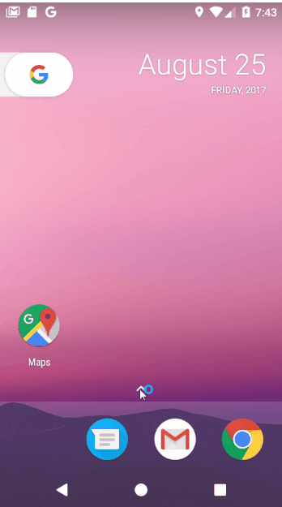

#  Welcome to GroupChat Android App
This project is to build a group chat android app by using Firebase cloud service for user authentication, real-time database and storage. It allows users to send and receive text and photos in realtime across platforms.

#  Final Demo:

##  Steps:
**1. Register Account in Firebase Console and Register an App**
    Add Google.JSON

**2. Firebase Settings**

**3. Message Class, MessageAdapter, itemview, RecyclerView, etc.**

